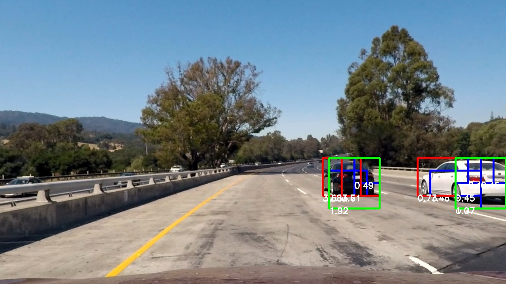
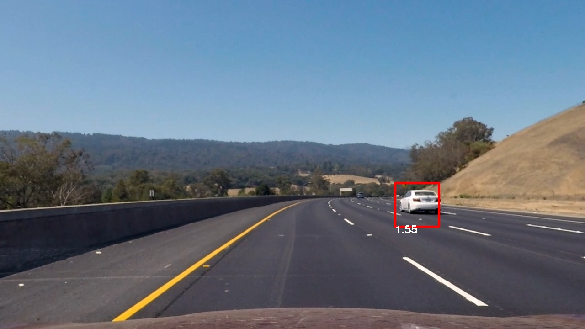
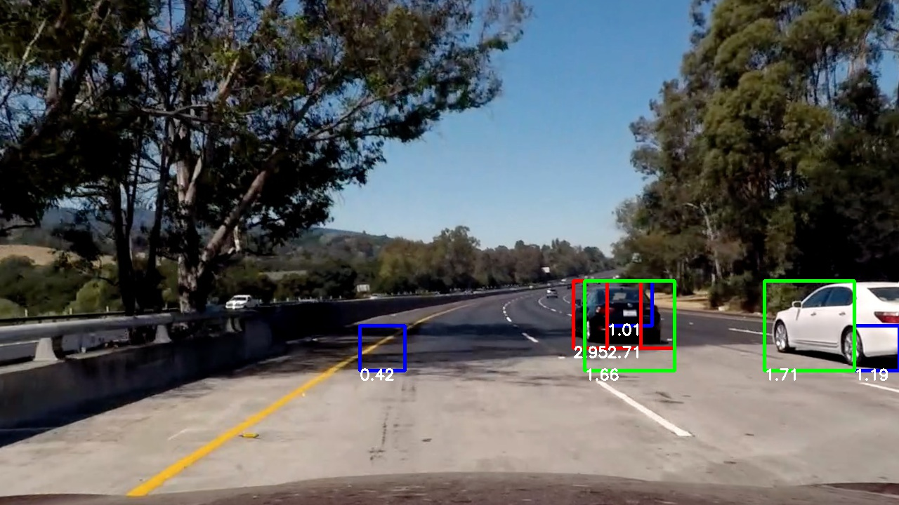
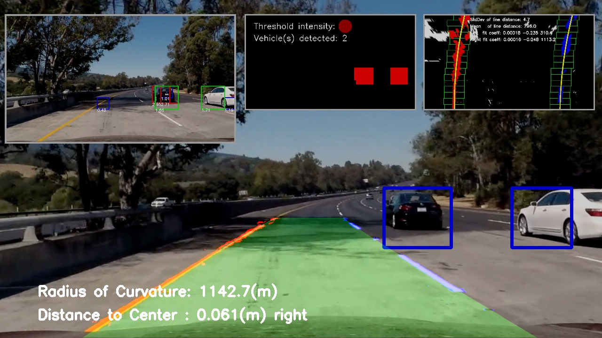
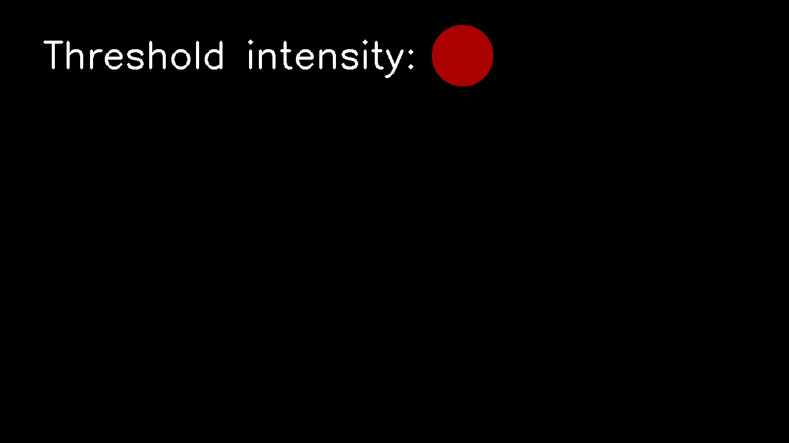
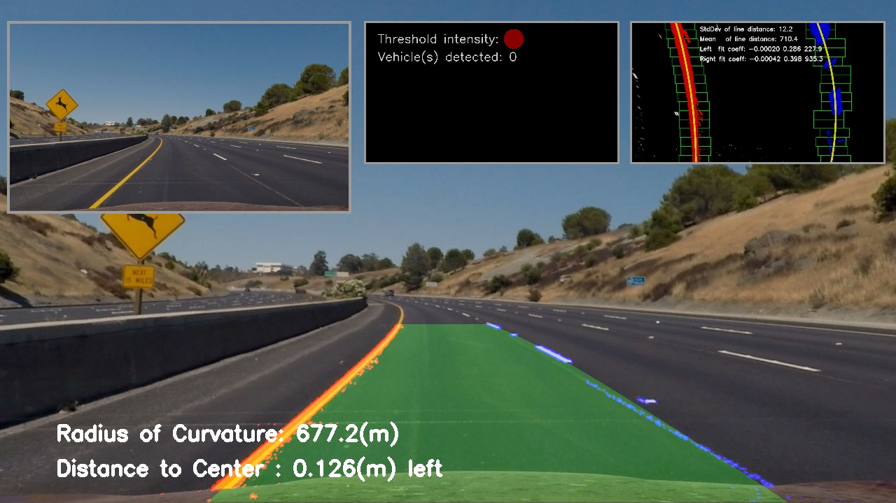
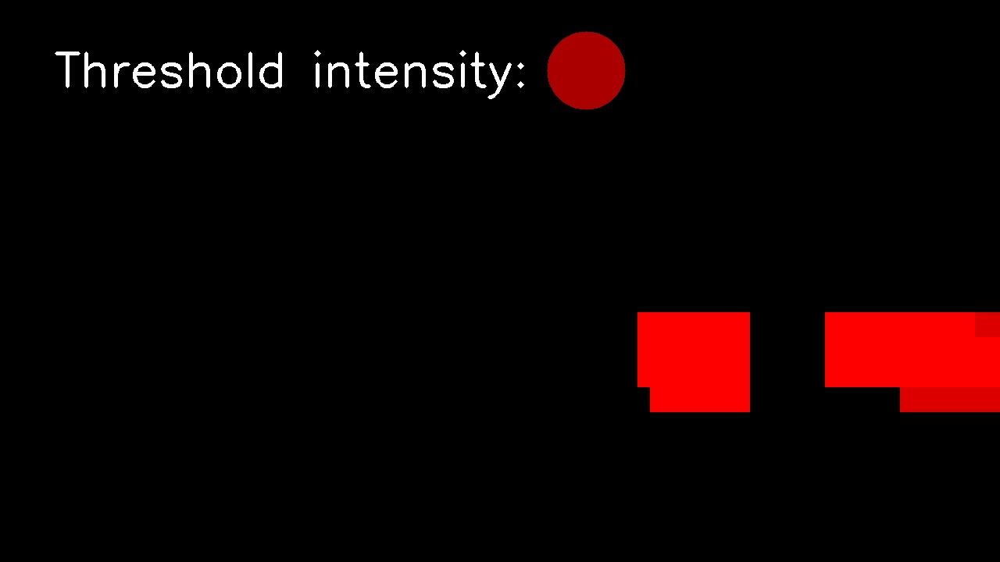
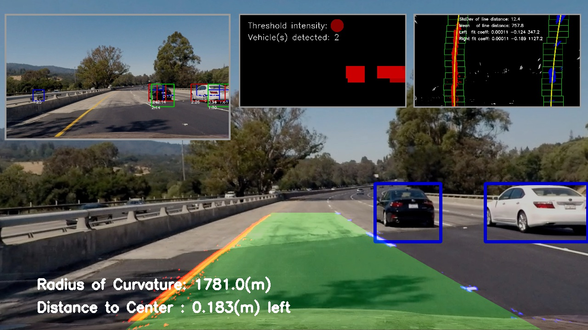
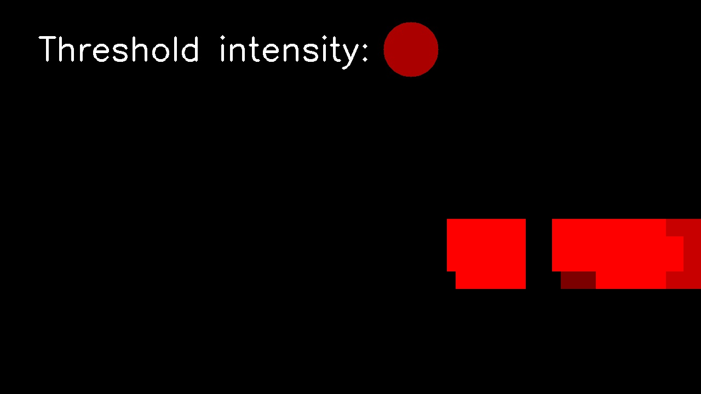
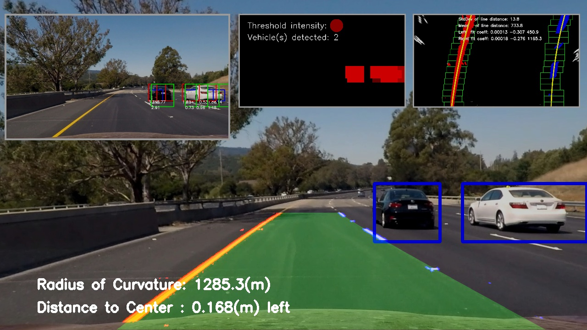

## Vehicle Detection Project
---
Yangchun Luo

Dec 29, 2017

This is the assignment for Udacity's Self-Driving Car Term 1 Project 5.

---
The goals / steps of this project are the following:

* Perform a Histogram of Oriented Gradients (HOG) feature extraction on a labeled training set of images and train a classifier Linear SVM classifier
* Optionally, you can also apply a color transform and append binned color features, as well as histograms of color, to your HOG feature vector. 
* Note: for those first two steps don't forget to normalize your features and randomize a selection for training and testing.
* Implement a sliding-window technique and use your trained classifier to search for vehicles in images.
* Run your pipeline on a video stream (start with the test_video.mp4 and later implement on full project_video.mp4) and create a heat map of recurring detections frame by frame to reject outliers and follow detected vehicles.
* Estimate a bounding box for vehicles detected.

[//]: # (Image References)
[image1]: ./examples/car_not_car.png
[image2]: ./examples/HOG_example.jpg
[image3]: ./examples/sliding_windows.jpg
[image4]: ./examples/sliding_window.jpg
[image5]: ./examples/bboxes_and_heat.png
[image6]: ./examples/labels_map.png
[image7]: ./examples/output_bboxes.png
[video1]: ./project_video.mp4

## [Rubric Points](https://review.udacity.com/#!/rubrics/513/view)
Here I will consider the rubric points individually and describe how I addressed each point in my implementation.  

---
### Writeup / README

#### 1. Provide a Writeup / README that includes all the rubric points and how you addressed each one.  You can submit your writeup as markdown or pdf.  [Here](https://github.com/udacity/CarND-Vehicle-Detection/blob/master/writeup_template.md) is a template writeup for this project you can use as a guide and a starting point.  

You're reading it!

Before I delve into the rest of the sections, let me provide an overview of the source code files.

<table>
<tr><th>Filename<th>Content
<tr><td>main.py<td>Entry point, parse command line arguments, load individual images or videos, overall image processing pipeline
<tr><td>train_classifier.py<td>Feature extraction from images, train a classifier to predict vehicle or non-vehicle
<tr><td>detect_vehicles.py<td>Vehicle detection pipeline code
<tr><td>find_lane_lines.py<td>Land finding pipeline code (adapted from the <a href="https://github.com/yangchunluo/udacity-self-driving-p4-adv-lane-finding">previous project</a>)
</table>

### Histogram of Oriented Gradients (HOG)

The overall logic for training the classifier works as the following:

- Load all the training images of [vehicle](https://s3.amazonaws.com/udacity-sdc/Vehicle_Tracking/vehicles.zip) and [non-vehicle](https://s3.amazonaws.com/udacity-sdc/Vehicle_Tracking/non-vehicles.zip) provided by the course.
- For each image:
  - convert to the given color space.
  - Get binned spatial features as a vector.
  - Get color histogram features as a vector.
  - Get HOG features as a vector.
  - Combine all the features in a single vector.
- Normalize features over all images.
- Generate label for each image.
- Split the labeled dataset into training and test set, and shuffle their orders.
- Train a linear SVM on the training set.
- Evaluate the accuracy on the test set.
- Dump the model, the parameters, and the feature scaler to a pickle file.

#### 1. Explain how (and identify where in your code) you extracted HOG features from the training images.

The code for HOG feature extraction is located in line 57 through 80 in `train_classifier.py`, using `skimage.feature.hog()` API. 

```python
def get_hog_features(img, params):
    """
    Get HOG features for all color channels and concatenate them in a flat vector.
    :param img: image in converted space
    :param params: feature extraction parameters
    """
    channel_hogs = [get_hog_features_for_channel(img, ch, params).ravel()
                    for ch in params.hog_channels]
    return np.concatenate(channel_hogs)


def get_hog_features_for_channel(img, channel, params):
    """
    Get HOG features for a color channel without raveling.
    :param img: image in converted space
    :param params: feature extraction parameters
    """
    if params.hog_orient is None:
        return np.array([])
    return hog(img[:, :, channel], orientations=params.hog_orient,
               pixels_per_cell=(params.hog_pix_per_cell, params.hog_pix_per_cell),
               cells_per_block=(params.hog_cell_per_block, params.hog_cell_per_block),
               transform_sqrt=True, feature_vector=False)
```

To support sub-sampling HOG features in the detection code, I provided two interfaces, one for a given color channel without raveling (used in detection), one for a set of color channels with raveling (used in training). The latter is just a wrapper of the former.

#### 2. Explain how you settled on your final choice of HOG parameters.

I have experimented with the following cominbations of HOG feature parameters:

- Color space: RGB, HUV, HLS, YUV, YCrCb
- Number of orientations: 8, 9, 11
- Pixels per cell: 8, 16 
- Cells per block: 2
- Channels: 0, 1, 2

I have eventually settled on the following combination through trial and error and some justification and trade-off. YCrCb definitely outperforms RGB. 8 pixels per cell generates a lot more (~7 times) features than 16 pixels per cell. It is not only significantly slower in feature extraction (a problem for processing video), but also tend to overfit given the small training data size. I used all three color channels.

I also included binned spatial features  and color histogram features in the same color space. Here is a summary of all the feature extraction parameters:

```python
FeatureExtractParams(color_space='YCrCb',
                     spatial_size=32,
                     hist_bins=32,
                     hog_orient=9,
                     hog_pix_per_cell=16,
                     hog_cell_per_block=2,
                     hog_channels=[0, 1, 2])
```

#### 3. Describe how (and identify where in your code) you trained a classifier using your selected HOG features (and color features if you used them).

After all the features are extracted from an image, they are horizontally stacked into a flattend 1D array. I applied feature scaling to normalize them across the entire sample set. The normalized features and correpsonding labels are fed into a linear SVM for training and validation. This corresponds to line 152 through 198 in `train_classifer.py`, with some excerpts below:

    print("Feature dimension {}".format(len(features[0][0])))
    print("Positive sample size {}".format(len(features[0])))
    print("Negative sample size {}".format(len(features[1])))

    # Feature normalization.
    X = np.vstack(features).astype(np.float64)
    scaler = StandardScaler().fit(X)
    X_scaled = scaler.transform(X)

    # Get the labels.
    y = np.hstack((np.ones(len(features[0])),
                   np.zeros(len(features[1]))))

    # Split up data into randomized training and test sets.
    rand_state = 37
    X_train, X_test, y_train, y_test = train_test_split(
        X_scaled, y, test_size=split_portion, random_state=rand_state)
    print("Training sample size {}: positive {} negative {}".format(
        len(y_train), len(y_train[y_train == 1]), len(y_train[y_train == 0])))
    print("Testing sample size {}: positive {} negative {}".format(
        len(y_test), len(y_test[y_test == 1]), len(y_test[y_test == 0])))

    # Train the SVM classifier.
    svc = LinearSVC()
    t0 = time.time()
    svc.fit(X_train, y_train)
    t1 = time.time()
    print(round(t1 - t0, 2), 'seconds to train SVC')

    # Test the SVM accuracy
    print('Test Accuracy of SVC = ', svc.score(X_test, y_test))


### Sliding Window Search

#### 1. Describe how (and identify where in your code) you implemented a sliding window search.  How did you decide what scales to search and how much to overlap windows?

For sliding window, I used HOG features sub-sampling approach for its efficiency. It works by first defining a set of search window scales (relative to the training sample size 64x64) and Y-axis search boundaries. For each window scale, the HOG features are computed once on Y-axis slice (defined by the boundary). Each time when a search window within the slice is tested, we can simply perform a lookup (sub-sampling) from the pre-computed HOG features. This is much more efficient compared to repeatedly computing HOG features for each search window.

By observing the size of vehicles in the project video, I picked three window scales: 1.0, 1.5, 2.0, and its corresponding Y boundary of (400, 600), (400, 656), (400, 680). The idea is that we only need to search in the lower half of the frame and smaller windows is further restricted to the middle section of the frame.

I chose `cell_per_step=2` which results in 75% overlap of search windows, according to the [course lecture](https://classroom.udacity.com/nanodegrees/nd013/parts/fbf77062-5703-404e-b60c-95b78b2f3f9e/modules/2b62a1c3-e151-4a0e-b6b6-e424fa46ceab/lessons/fd66c083-4ccb-4fe3-bda1-c29db76f50a0/concepts/c3e815c7-1794-4854-8842-5d7b96276642).

The corresponding code is in line 63 through 178 in `detect_vehicles.py`.

#### 2. Show some examples of test images to demonstrate how your pipeline is working.  What did you do to optimize the performance of your classifier?

As previously mentioned, I used HOG features on all three YCrCb channels. I picked three search window scales. For each scale, I used computed HOG features **once** on the corresponding Y-axis slice and repeatedly sub-sample it for different search window location. Other features, spatially binned color and color histogram, are computed for each search window. But they are very cheap to compute. As a minor optimization, I did color conversion for the entire frame outside the loop for search window scale.

Here are a few sample output. I used different colors for different window scales (for better visualization) and annotated each window with the confidence score output by classifier.




---

### Video Implementation

#### 1. Provide a link to your final video output.  Your pipeline should perform reasonably well on the entire project video (somewhat wobbly or unstable bounding boxes are ok as long as you are identifying the vehicles most of the time with minimal false positives.)

Here's a [link to my video result](./result_project_video.mp4). Here I also integrated with the lane-finding pipeline from the previous project, and overlaid a few diagnosis windows. Here is an snapshot.



#### 2. Describe how (and identify where in your code) you implemented some kind of filter for false positives and some method for combining overlapping bounding boxes.

In the sliding window search, I used the SVM confidence score to reject low-quality detections (min_threshold=0.1, can also vary as the window scale). I also recorded the SVM confidence score of each window retained (line 138-149 in `detect_vehicles.py`).

I used the confidence score of each window to build the initial heatmap. Then I pruned the low quality windows if the portion of their high-confidence pixels (pixel confidence score > 1.3) is below a threshold (50%).

    # Build the current heat map using confidence score for each search window.
    heatmap = np.zeros(img.shape[:2]).astype(np.float)
    for box, confidence in positive_windows:
        heatmap[box[0][1]:box[1][1], box[0][0]:box[1][0]] += confidence
        
    # For each search window, count the portion of high-confidence pixels.
    # If below a threshold, remove this low-quality window.
    heatmap_copy = np.copy(heatmap)
    for box, confidence in positive_windows:
        roi = heatmap_copy[box[0][1]:box[1][1], box[0][0]:box[1][0]]
        above_count = np.count_nonzero(roi >= HEATMAP_THRESHOLD_WINDOW)
        if above_count / float(roi.shape[0] * roi.shape[1]) < HEATMAP_THRESHOLD_WINDOW_PORTION:
            heatmap[box[0][1]:box[1][1], box[0][0]:box[1][0]] -= confidence

I then aggregated heatmaps over past frames using exponential decay (decay_rate=0.2), which has the following advantage:

- Smooth out true positive regions over continuous frames.
- Provide some stability over false negative, i.e. losing one frame's detection in between continuous successful detections.
- Prevent a single false positive detection to show up in final detection, since it has to persist in a few consecutive frames in order to stand out from the next threshold step (see below).

```python
if vehicle_hist is not None:
    # First frame.
    if vehicle_hist.heatmap is None:
        vehicle_hist.heatmap = np.copy(heatmap)  # IMPORTANT: must deep copy
    # Exponential decay update.
    vehicle_hist.heatmap *= (1 - vehicle_hist.decay_rate)
    vehicle_hist.heatmap += heatmap * vehicle_hist.decay_rate
    del heatmap
    # For the rest of the function. Must deep copy.
    heatmap = np.copy(vehicle_hist.heatmap)
```

After the aggregation over past frames, I applied a threshold to each indvidual pixels to remove low-confidence ones.

    heatmap[heatmap < HEATMAP_THRESHOLD_PIXEL] = 0 

I then used `scipy.ndimage.measurements.label()` to identify individual blobs in the heatmap. I then assumed each blob corresponded to a vehicle.  I constructed bounding boxes to cover the area of each blob detected.

Here are a few example images showing the heatmap and final output. Note that the heatmap intensity has been boosted for better visualization, with the threshold intensity (below which the pixel is removed) shown on top.

<table>
<tr><th>Heatmap<th>Final output
<tr><td><td>
<tr><td><td>
<tr><td><td>
</table>

The corresponding code is in line 186 through 242 in `detect_vehicles.py`.

---

### Discussion

#### 1. Briefly discuss any problems / issues you faced in your implementation of this project.  Where will your pipeline likely fail?  What could you do to make it more robust?

The classifier can be further improved with better features and feature parameters. It can also benefit from a large training set. In this project, I used SVM as a black box. I could experiment with other types of classifiers as well, e.g. logistic regression, gradient boosting trees, and etc. In a more radical remake, I could try convolution neural networks (CNN) and completely forgo the feature engineering step, which I found is quite an act of art. I would use mini-batch and drop-out layers to improve generalization for CNNs. 

I have found that aggregating over past frame greatly improved stability and removed all false positivie detection. This can be demo using a circlar queue based approach to average over past N frames. I chose exponential decay given its implementation simplicity and theoretical justication.

To improve overall pipeline performance, I noticed that once the image frame is undistorted, finding lanes and detecting vehicles are completely independent. I overlapped their execution with two threads--this completely hiddens the execution time of land-finding pipeline.


    # Parallelize the two pipelines
    threads = []
    thread_result = {}

    def call_vehicle_detection(t_result):
        t_result["vehicles"] = vehicle_detection_pipeline(img, vehicle_detection_params, vehicle_hist,
                                                          output_dir, img_base_fname)
    threads.append(threading.Thread(target=call_vehicle_detection, args=(thread_result,)))

    def call_land_finding(t_result):
        t_result["lanes"] = lane_finding_pipeline(img, lane_hist, output_dir, img_base_fname)
    threads.append(threading.Thread(target=call_land_finding, args=(thread_result,)))

    for t in threads:
        t.start()
    for t in threads:
        t.join()
    
    vehicles, searchbox, heatmap = thread_result["vehicles"]
    diag_window, lane_region, lane_pixels, radius, distance = thread_result["lanes"]

